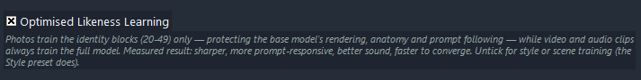
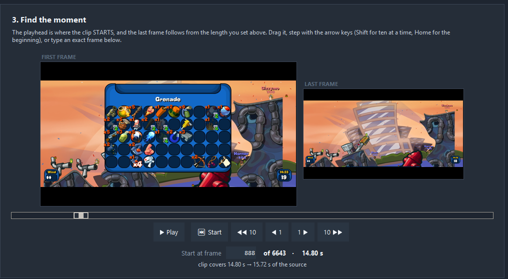
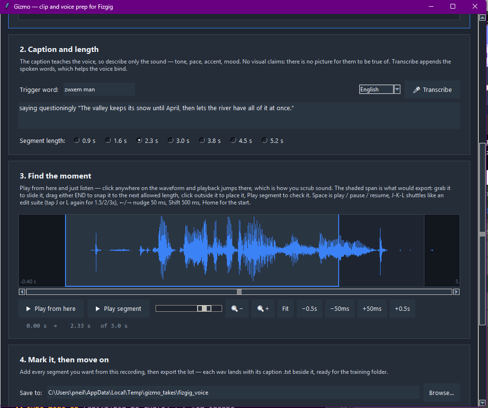

<h1 align="center">Fizgig — Klein 9B, Krea 2 & MiniMax H3 LoRA Studio</h1>

<p align="center">
  <strong>Fix broken LoRAs without retraining. Remix any LoRA into new variations in seconds.</strong><br>
  A train · repair · explore workbench built end-to-end for <strong>Flux 2 Klein 9B</strong>, <strong>Krea 2</strong> and <strong>MiniMax H3</strong> — now training on video, sound and voices.
</p>

<p align="center">
  <a href="#install"></a>
  <a href="https://console.runpod.io/deploy?type=GPU&gpu=RTX+5090&count=1&template=faoq8ed6um&ref=vkb387ep"></a>
  <a href="https://buymeacoffee.com/lorasandlenses"></a>
</p>
<p align="center">
  <sub>No GPU, or want a bigger one? Fizgig runs on rented hardware — one click, nothing to install.<br>
  Deploying through that link supports Fizgig's development at no extra cost to you.</sub>
</p>

<p align="center">
  <a href="https://www.youtube.com/watch?v=yrz0l6URGGk"></a>
</p>

<p align="center">
  <a href="https://www.youtube.com/watch?v=yrz0l6URGGk"></a><br>
  <sub>Start-to-finish walkthrough — install, prep, caption, train, and the workbench tools</sub>
</p>

<p align="center">
  
</p>

> ### 📰 Latest news
> - **Fizgig 4.2 — the workbench opens to MiniMax H3, and what it found ships as features** — all five post-training tools now work on H3 LoRAs, with previews rendered as 22-frame clips judged by their middle frame. Using those tools on real LoRAs produced the first **H3 block map** — and its biggest finding is now **Optimised Likeness Learning**, a default-on checkbox that trains photos on the identity blocks only: sharper, more prompt-responsive, better sound, fewer epochs. Plus a **✨ MiniMax H3 Style** preset, an **Append Transcription** button that Whispers a clip's speech into its caption, and fully offline transcription. [Details ↓](#minimax-h3--third-model-family) · [Release notes](docs/RELEASE_NOTES_v4.2.0.md)
> - **Fizgig 4.0 — video, sound and voices** — MiniMax H3 now trains on **video clips**, on **their sound**, and on **voice recordings alone**: photos, clips and voice files in one folder train one LoRA in one run. **Gizmo**, a new bundled prep tool, cuts to-spec clips from any footage, auto-chops long videos at scene cuts, and records a voice dataset from nothing but a mic and ten minutes of reading. Training previews render in **6 steps** with the Turbo LoRA and can carry their **generated sound**, opening in the gallery as playable clips. And **16 GB / 24 GB cards now train on the accurate int8 base** — block swap streams one-way, ~6× faster, contributed by **[@rintic-13](https://github.com/rintic-13)**. [Details ↓](#minimax-h3--third-model-family) · [Release notes](docs/RELEASE_NOTES_v4.0.0.md)
> - **MiniMax H3 LoRAs now work without the Turbo LoRA** (3.7.0) — a LoRA that looked right in a 4-step Turbo workflow could go soft or distort in the stock 20-step one, and the workaround was to drop its strength. The cause was a setting called **mid-concentrated**, which has been removed: across five datasets, LoRAs trained without it hold up at full strength with Turbo unloaded. The old percentage box is now a named **Training Structure** control on the Training tab. Also in the release: a substantial security audit by **[@FNGarvin](https://github.com/FNGarvin)**. [Release notes](docs/RELEASE_NOTES_v3.7.0.md)
> - **The workbench checks your LoRA before it loads 9 GB** (3.6.4) — pick a Krea 2 LoRA with the selector on Klein 9B in **Royale**, **Explorer** or **Repair Studio** and it now switches to match in milliseconds, instead of loading the wrong pipeline and failing 25 seconds later. Installs got faster and lighter on disk in the same release. All of it contributed by **[@FNGarvin](https://github.com/FNGarvin)**. [Release notes](docs/RELEASE_NOTES_v3.6.4.md)
> - **One-click cloud training on RunPod** — no GPU, or want a 5090 for the afternoon? The official Fizgig template deploys the full app to a rented GPU in your browser: nothing to install, your files persist until you terminate the pod, and the in-app RunPod panel can even **auto-stop the pod when your run finishes** so an idle GPU never bills overnight. [**⚡ Deploy →**](https://console.runpod.io/deploy?type=GPU&gpu=RTX+5090&count=1&template=faoq8ed6um&ref=vkb387ep) · [Guide](docker/README.md)
> - **Krea 2 trains on 8 GB** — confirmed by users running nothing but the stock preset defaults at batch size 1, with everything left on Auto. 10–12 GB cards do the same with headroom to spare. [VRAM guidance ↓](#vram-guidance)

---

## What Fizgig is

Every trainer makes LoRAs. Fizgig is built around what you do with them **afterwards** — and that's the part nobody else has.

- **Fix** a baked LoRA block-by-block, no retraining — overbaked identity, crushed style, drag a slider, save a new `.safetensors`.
- **Explore** new variations like a game — the app proposes mutations, you pick favourites, the LoRA evolves through selection.
- **Find** the best LoRA by eye — **LoRA Royale** renders every epoch of a run (or any folder of LoRAs) on one seed; crossfade to the one that *feels* right.
- **Share** what you made — LoRA Royale exports the epoch morph, or travels a single LoRA through seeds, prompts, or strength, as a looping MP4/GIF made to share.
- **Profile** exactly which blocks carry identity, style, and detail — so you know what to touch before you touch it.

Under the workbench sits a fast, light trainer tuned to **fit your GPU**: a full **Klein 9B** LoRA trains on **16 GB**, the 12.9B **Krea 2** on **8 GB**, and the 33B **MiniMax H3** on **16 GB** — block swap, quantisation and previews all size themselves to your VRAM automatically, and if a preview can't fit, training keeps running and saving. It loads kohya / PEFT / OneTrainer / AI-Toolkit / LyCORIS LoRAs, auto-converted, and saves kohya `.safetensors` that drop straight into ComfyUI.

**Free and open source.** A good first run: pick a ✨ built-in preset on the Training tab and go.

---

## The workbench

Each tool works on a trained run's output **or any LoRA you've downloaded** — and they hand off to each other (profile → repair → explore → compare, one closed loop). All three families: Klein, Krea 2 and MiniMax H3 (H3 previews render a short clip, judged by its middle frame — the model's native regime).

### Repair Studio
A live slider per transformer block (32 on Klein, up to 50 + the token refiners on MiniMax H3) with a side-by-side preview that updates as you drag. **Turbo Preview** caches per-block activations so late-block edits redraw up to 97% faster; the baked save is always exact. Blend blocks from a second **donor** LoRA, balance the pair per block, condition previews on a reference photo, and save a `.safetensors` that works in ComfyUI at strength 1.0.

### LoRA the Explorer
Evolutionary discovery: the app mutates blocks and shows four variants — pick a favourite and it becomes the new baseline. Freeze what you like, set how far composition drifts, cycle seeds — and send any baseline to Repair Studio (and back) with one click.

### LoRA Royale
Point it at a training run and it renders **every epoch on one fixed seed**, with a crossfade slider — drag until it looks best and stop. An optional **likeness score** (ArcFace, CPU) rates each epoch against a training photo and jumps you to the best. Then make it shareable: epoch-morph clips, seed / prompt / strength **travels**, a **comparison sheet** (with/without-LoRA grid, same seed per row), all exportable as looping MP4/GIF with an optional deflicker pass. Works on any folder of LoRAs, or a single file.

### Profiler
A per-block activation profile as a colour-coded HTML report — which blocks carry style, identity, and detail, and where they overlap. Repair Studio reads its sidecar automatically and shows the findings inline when you load the same LoRA.

### Extract
Distil any Klein, Krea 2 or MiniMax H3 LoRA to a lower rank — Fast presets run weight-only SVD with no models loaded; Klein's activation-weighted presets add block and timestep targeting. PEFT and LyCORIS sources supported.

---

## Krea 2 — second model family

A from-scratch native port: 12.9B single-stream MMDiT, Qwen-Image VAE, Qwen3-VL-4B text encoder. Train on the **RAW model**; previews render on the training model itself with the official Turbo LoRA (auto-downloads) applied for the render only. Pick Krea 2 from the **Base Model selector** on the Training tab and the **✨ Krea 2 Defaults** preset applies itself.

Everything works on Krea 2: all five workbench tools, **Pause/Resume**, **Context LoRA**, **Adaptive LR**, reference images, the live sample override — and **LoKR training** (pick it from Network Type; factor 8 or below for the quality edge, standard LoRA is ~20% faster). Output is ComfyUI-ready.

> **8 GB is enough.** Users train full Krea 2 LoRAs on 8 GB with everything on **Auto** and batch size 1. Auto reads your *free* VRAM and picks INT8, NF4 or fp8 plus the right block swap — the console explains its choice. On longer runs the transformer blocks **torch.compile** automatically for roughly 2× faster steps.

### The trainer curates your dataset while it trains (Krea 2, experimental)

Four Training-tab toggles no other trainer has:

- **Detect problem images** — per-image loss is tracked across epochs (noise-normalised); images that stay hard without improving get flagged in a live **Problem Images window** with thumbnails and trends. In real runs the top flags were all caption/image mismatches.
- **Per-image adaptive LR** — flagged images are throttled so one bad caption can't yank the weights all run; healthy images get a gentle boost. Matched-epoch A/Bs: faster likeness *and* a higher ceiling.
- **Auto-recaption stuck images** — the text encoder *looks at* each stuck image between epochs and rewrites its caption from what's visible. Still stuck after two attempts and the image is excluded for the run (remembered per-dataset; fix the caption and it's re-admitted).
- **Warm up look outliers** — real-but-unusual shots (tight angles, profiles) ease in at reduced LR while the identity forms, then release to full.

Edit any caption yourself mid-run from the Problem Images window — no restart. When nothing is improving any more, a plateau banner names the best-checkpoint window to scrub in LoRA Royale. Pause, resume, restart: a resumed run replays its own loss log and loses nothing.

> **📣 Help map Krea 2's blocks — [open an issue](https://github.com/shootthesound/Fizgig/issues).** Krea 2's per-block roles aren't charted yet, which is why the colour-coded sliders and layer targeting are Klein-only for now. The Profiler's weight-only report is the instrument — share what you find and it drives the presets and Repair Studio colour-coding to come.

---

## MiniMax H3 — third model family

Fizgig trains LoRAs for **MiniMax H3**, MiniMax's open-weight ~33B video model, from ordinary still-image datasets — and from **short video clips, their sound, and voice recordings** ([details ↓](#training-on-video-clips--and-on-their-sound)) — on a single consumer GPU. Output loads straight into ComfyUI's H3 workflows, including the pruned inference builds.

**The full studio, as of 4.2.** H3 trains, previews and pauses/resumes like the other families — and all five workbench tools now work on H3 LoRAs too, with previews rendered as short clips judged by their middle frame. It was those tools, on real LoRAs, that produced the block map behind Optimised Likeness Learning below.

**How it works:** pick **MiniMax H3** from the Base Model selector and the usual flow applies — Start-tab folder, Captions, Samples, Training. Leave **Blocks Swap** and **Base Precision** on Auto: at launch the trainer reads your **free** VRAM (close ComfyUI first) and picks the base precision and block-swap count together:

| Free VRAM | What Auto does |
|---|---|
| ~30 GB | **int8**, no block swap, up to 1 MP |
| ~22 GB | **int8**, ~14 blocks streamed |
| ~15 GB | **int8**, ~36 blocks streamed |
| ≤12 GB | **4-bit**, as before |

int8 is the checkpoint's own storage and the most accurate base (~0.17% error). Block swap **streams one way only** — ~6.4× faster than round-trip swap, which is what lets 16 and 24 GB cards keep the accurate base (design contributed by [@rintic-13](https://github.com/rintic-13), [#73](https://github.com/shootthesound/Fizgig/issues/73)). Hit an OOM anyway? Set Blocks Swap to a number to override the planner.

Three built-in presets ship; **Defaults** applies the moment you pick the family:

| Preset | Settings |
|---|---|
| **✨ MiniMax H3 Defaults** | LoRA dim/alpha 16, 60 epochs, **0.25 MP**, Training Structure **Likeness and Style**, `adamw`, flat 1e-4 |
| **✨ MiniMax H3 Fast** | The same at **rank 8, 40 epochs, flat 2e-4**. Reaches likeness in a few hundred steps, and the lower rank tends to come out more flexible |
| **✨ MiniMax H3 Style** | Fast with blocks `0-3, 6-47` and a gentler flat 1e-4 — style lives almost everywhere in H3, and the early blocks it needs want small, consistent updates |

<p align="center"></p>

**Optimised Likeness Learning** ships ticked (Defaults and Fast; Style unticks it): photo steps
train only the identity blocks (**20-49**) while video and audio clips train the full model.
Measured against full-model photo training: sharper, much better prompt following, better sound,
fewer epochs — and the occasional deformed preview of full-model photo runs is gone. Untick it
for style or scene training; while it's on, Blocks to Train is disabled with a note.

**0.25 MP is the default, and it holds up** — four times cheaper per step than 1 MP, and the extra resolution has not paid for itself in testing. Raise it if a specific dataset asks for it.

**Previews default to 768×768, 56-frame clips with sound** — a short watchable clip with the model's generated audio, opened in the gallery as a playable video (never autoplay). Without the audio VAE set, clips render silent; stills and other lengths stay in the dropdown. Set the **Turbo LoRA** in Preferences and previews render in **6 steps instead of 20** — previews only, never the saved LoRA. A preview that outgrows VRAM steps itself down a ladder rather than dying — a shorter clip first, then resolution to a 512×512 floor — and the size that fit is saved as the new default.

### Video and sound: how do I…

**…train on video clips?** Cut them with **Gizmo** (launch it from the Image Prep tab, or the *Launch Gizmo* .bat) — it exports clips already on H3's spec — drop them into the training folder next to your images, and caption them on the **Captions tab** like a photo. **Photos, clips and voice recordings all train together in the same folder** — no settings, no separate runs.

**…make clips from my footage?** Open Gizmo, drop a video on it, scrub to a moment, pick a length, *Add to queue* — repeat, then *Export queue*.

**…chop a long video automatically?** Gizmo's **✂ Auto-chop** scene-detects the whole source and offers every segment as a thumbnail — click to keep or skip, and the keepers join the queue.

**…train a voice from a recording?** Gizmo's **Voice** tab: open any audio file (or a video, for its soundtrack), mark segments on the waveform, caption the sound, export — segments come out training-ready with their captions beside them.

**…record a voice dataset from scratch?** Voice tab → **🎙 Record**: read the prompted sentences while holding the button (or the **R** key). Every take arrives trimmed and captioned; ten minutes of reading is a usable dataset.

**…keep a clip's sound out of training?** Mute it in Gizmo — it adds `_mute` to the filename, reversible by renaming. The video still trains.

**…train photos, clips and a voice into one LoRA?** Same folder, one trigger word, one run, any mix. If one category is much smaller, **Finish one category early** on the Training tab lets it finish at a chosen epoch while the rest trains on.

**…get fast previews while training?** Set the **Turbo LoRA** (~780 MB, its own Preferences row): 6-step previews with the Turbo at 75% on top of your training LoRA. Adjustable on the Samples tab.

**…hear what it's generating while training?** Pick a **"with sound"** Sample length on the Samples tab. Each preview carries its generated soundtrack, playable in the gallery.

**…get a clip's spoken words into its caption?** Open it in the caption editor (Captions tab → click the clip): any non-muted video shows an **🎤 Append Transcription** button that Whispers the speech into the caption as `saying "…"` — Gizmo's grammar, without leaving the tab.

**…set it up?** One extra model file for sound: the **audio VAE** (~605 MB), on its own Preferences row. Blank = clips train silent; required only once the folder has voice recordings. Fizgig points out both new files once at startup if your H3 paths are set.

### Training on video clips — and on their sound

Stills teach H3 a look; clips teach it **motion**, and clips with sound teach it **a voice**. Clips cost far more per step than stills — start with a handful. Drop `.mp4` clips into the training folder alongside your images and caption them like photos. A clip has to be on spec, and Fizgig refuses one that isn't rather than quietly fixing it:

| | Requirement |
|---|---|
| Container | `.mp4` |
| Frame rate | exactly 24 fps |
| Frame count | 5, 22, 39, 56, 73, 90, 107 or 124 frames |
| Dimensions | multiples of 32 |
| Audio | 32 kHz stereo, or no track at all |

<p align="center"></p>

**Gizmo makes clips that hit it** — mark every section you want (frame-accurate stepping, first/last-frame previews, a ▶ Play of the exact clip), then export the lot in one go. **Crop to the subject**: a clip's cost is its pixels, so drag a rectangle and every token goes on what you want learned — with shape locks (1:1, 16:9, 9:16…) when you want consistent framing. High-frame-rate footage can keep extra frames as slow motion, offered as a choice. Clips are cut at native resolution and resized to your Target Megapixels at training time, so cutting large keeps the choice open.

**What it costs:** 22 frames is the shortest that shows real movement at ~7× a still per step; 124 frames is ~37×. Gizmo says which lengths your card can train, at which megapixels, before you cut anything:

| Clip | 16 GB | 24 GB | 32 GB |
|---|---|---|---|
| up to 56 frames | up to 0.25 MP | up to 0.5 MP | up to 0.5 MP |
| 73–90 frames | — | up to 0.25 MP | up to 0.5 MP |
| 107–124 frames | — | up to 0.25 MP | up to 0.25 MP |

### Training on a voice alone

Drop **`.wav` / `.mp3` / `.flac` / `.m4a`** files into the training folder — alone or mixed with stills and clips. Rate and channels are converted for you; **duration is the strict part**:

| | Requirement |
|---|---|
| Formats | `.wav` `.mp3` `.flac` `.m4a` — any rate or channel count |
| Duration | exactly 0.917, 1.625, 2.333, 3.042, 3.750, 4.458 or 5.167 s (±25 ms) |
| Content | actual sound — digital silence is refused |
| Caption | a `.txt` beside the file, or it silently won't train |
| Audio VAE | required — the ~605 MB Preferences row |

<p align="center"></p>

**Gizmo's Voice tab cuts them for you** — open a recording (or a video, for its soundtrack), mark segments on the waveform, pick a length, caption, export sample-exact. **Caption the voice, not a picture** — *"a man speaking calmly, low pitch, unhurried"* — with your trigger word leading; the **Transcribe** button (Whisper) appends the spoken words. **Or record the dataset from scratch**: **🎙 Record** prompts sentences across every length and five tonal flavours, rolls a delivery style per take, and every hold-and-release lands trimmed, captioned and ready to queue. **Set Training Structure to Likeness and Style for voices** — tested head-to-head, it converges much faster; Fizgig reminds you when it sees voice files.

### Model files (MiniMax H3)

Each has a **Download link on its row in Preferences**:

| Model | Size | Notes |
|---|---|---|
| DiT — pruned int8 | ~21 GB | The training base — `minimax_h3_fl2va_pruned_int8_convrot.safetensors`, the same file ComfyUI runs. (The ~66 GB bf16 file also works, NF4 at load) |
| Qwen3-VL-32B text encoder | ~15.7 GB | The **nvfp4** file — same one ComfyUI uses. Loaded once for caching, then freed |
| Video VAE | ~4.9 GB | Caching and preview decode |
| Audio VAE *(optional)* | ~605 MB | Sound training and previews with sound |
| Turbo LoRA *(optional)* | ~780 MB | 6-step previews — `minimax_h3_turbo_v4_step600.safetensors`; you may have it in ComfyUI's loras folder |
| DiT — reference *(optional)* | ~21 GB | Only for reference distillation (`ref2va`) |

**Yes, you train on the pruned file.** "Pruned" here swaps the AdaLN modulation MLP for a curve table — that branch only sees the timestep, so nothing a LoRA learns lives there. You train against the exact weights you deploy on.

### Training-tab controls worth knowing

Every control has a hint in the app; the highlights:

- **Training Structure** (default **Likeness and Style**) — how much of the run trains on nearly-clean images, where likeness *and* style live. **Model default, movement** is the reference trainer's schedule; **Custom** exposes the raw percentage. **Medium to High LR** beside it is best left at 100.
- **Optimised Likeness Learning** (default On) — photo steps train the identity blocks (20-49) only; clips train the full model. The measured best recipe for character and voice work — untick for style or scene training.
- **Blocks to Train** — hand-pick a subset of H3's 50 blocks (disabled while Optimised Likeness Learning owns the choice). The measured recipes: **`20-49` for likeness**, **`0-3, 6-47` for style** (the Style preset sets it), voice core `38-48`. Type ranges (`3-12, 22, 31-33`) to experiment beyond them.
- **Reference distillation** (experimental) — teaches the LoRA to render your subject from the trigger word the way H3 renders them from a *photo*: each image is marked against the model shown *other* photos of the same person, so identity is learned without the scenery. Needs the ref2va model; the LoRA deploys on the ordinary model. **Aimed at Multi Concept**, where it demonstrably helps hold two people apart. **Identity-first** (Auto) trains a teacher-only first phase, then pure photos.
- **Multi Concept** — two subjects, two folders, two trigger words, one LoRA. Each subject's images are only ever compared against their own.
- **Adapter-relative LR** (default Off) — the LR box becomes a ceiling the run climbs toward, keeping each step proportional to the adapter's size. Worth trying when a run overshoots early.
- **Caption dropout** (default 0.05) and **Weight averaging (EMA)** (default Off) — leave dropout on; switch EMA on when pushing LR hard.
- **Using the Turbo LoRA in ComfyUI? Skip its custom sampler** — current ComfyUI samples H3 audio cleanly with stock Euler; community consensus is 8 steps, with `minimax_h3_turbo_v4_step600_ema` the strongest checkpoint.

Settings are read at launch; Pause → Resume relaunches with your current settings, so a pause is the moment to change them mid-run.

---

## Training (Klein 9B)

The foundation: fast, light, and tuned for one model.

- **Proven presets** for single subject through multi-character — or roll your own.
- **Context LoRA** — load an existing LoRA as a frozen *active* layer so the new one learns to coexist: a face on top of a style, an outfit on top of a character. No other trainer does this.
- **Adaptive LR** — a bi-directional plateau tracker: set the Min/Max window and it probes up on steady descent, pulls down (with rollback) on plateau or instability.
- **fp8 Base training** — the fp8 Base stays resident at ~9.6 GB, so a full 9B LoRA trains in ~14 GB and fits a 16 GB card. Automatic.
- **Distilled training samples** — 4-step previews that match ComfyUI output closely, multiple prompts (one per line on the Samples tab), and optional **reference-conditioned** samples (Klein is an edit model — previews can edit a real photo).
- **Pause / Resume** — graceful epoch-boundary pause that frees your GPU mid-run and resumes with full state.
- **Model Area targeting** — train only Identity, Style, or Detail blocks, or the full model.
- **Per-dataset caches, cross-checked** — deleted images leave the run; switched datasets can never leak in.

### The sample gallery is an instrument (both families)

- **Live likeness scoring** — pick 3 dataset photos and every sample gets a colour-coded likeness badge (ArcFace, CPU — zero training-speed cost), with a per-epoch trend chart and best-epoch highlight, live while the run goes.
- **Training Run Visualiser** — scrub the run epoch by epoch in the browser, Royale-style, with share-ready WebM/PNG export.
- A **live sample override** in the status bar changes the preview prompt, seed, size or reference mid-run, no restart. The status bar itself carries VRAM/RAM gauges with per-run peak markers.

### Dataset prep

- **AI captioning with the captioner that trains your model** — Krea 2's Qwen3-VL writes viewpoint-aware training captions in five editable preset styles (including **Style**, which describes everything *except* the look so your trigger word binds to it). Every preset's instruction is editable in plain English and persists. Florence-2 remains the zero-setup option. **Bilingual captions** (English + Chinese via Helsinki-NLP) act as text-level augmentation — measurably better skin detail on Klein at identical loss.
- **Image Prep** — batch resize, PNG conversion, InsightFace face-crops with gender targeting. Pairing a tight crop with a full shot adds a lot to a character dataset.
- **Look Consistency Filter** — pick the 3 images that best nail the look and every image is scored against them (ArcFace). Worst matches surface first; mark drifters or let Auto-Suggest flag the outliers, then move them out in one click — nothing is deleted, and the scores feed the Krea 2 trainer's look-outlier warm-up.

### Compatibility

Loads kohya, PEFT, OneTrainer (OMI + legacy), AI-Toolkit, and LyCORIS (LoKR / LoHa) — auto-converted, and LoKR/LoHa run natively everywhere: Repair Studio, Profiler, Extract, Context LoRA. Repair Studio and Explorer save LoKR as LoKR, losslessly. Output is `.safetensors` that drops straight into ComfyUI.

---

## No GPU? Rent one

Fizgig ships as a ready-made cloud image — the **whole app in a browser tab**, not a cut-down web version. Drag datasets in and LoRAs out with a built-in file manager, download models in one click, and optionally have the pod **shut itself down when training finishes**. Your models and datasets persist between sessions.

**[⚡ Deploy on RunPod →](https://console.runpod.io/deploy?type=GPU&gpu=RTX+5090&count=1&template=faoq8ed6um&ref=vkb387ep)**  ·  [Read the guide first](docker/README.md)

---

## Requirements

- **GPU** — NVIDIA RTX 30 / 40 / 50-series, or **AMD Radeon** with ROCm (RDNA1 through RDNA4, Strix Point / Halo, Instinct MI300+). **Klein 9B** needs 16 GB, **Krea 2** trains on 8 GB, **MiniMax H3** on 16 GB — see [VRAM guidance](#vram-guidance). The fp8 Base's VRAM savings apply on NVIDIA Ada+; on AMD, NF4 and INT8 are the primary quant paths.
- **NVIDIA driver** — 555+ on Windows, 550+ on Linux (CUDA 12.8 wheels).
- **AMD ROCm** — **Windows:** `install_fizgig_rocm.bat` (supported path). **Linux:** `./install_fizgig_rocm.sh` — **highly experimental** (newer gfx like RDNA4, desktop compositor + training on the same GPU, and driver resets are common; use Windows ROCm or NVIDIA Linux for production training). Optional system `amdrocm-amdsmi` for accurate status-bar VRAM via `amd-smi`.
- **OS** — Windows 10 / 11 or Linux. macOS handles captioning and image prep, but training needs CUDA or ROCm.
- **Python** — 3.10 – 3.13.
- **Disk** — ~10 GB for the venv, plus ~40 GB for model files.
- **Visual Studio Build Tools** (Windows only) — for InsightFace and the torch.compile speedup: **[aka.ms/vs/17/release/vs_BuildTools.exe](https://aka.ms/vs/17/release/vs_BuildTools.exe)**, tick **"Desktop development with C++"**. Without it everything still works minus the compile speedup.

---

## Install

Clone the repo:

```bash
git clone https://github.com/shootthesound/Fizgig.git
cd Fizgig
```

**Clone it rather than downloading the ZIP** — `update_fizgig.bat` updates by pulling with git, and a ZIP can't.

<details>
<summary><b>Already installed from a ZIP? Fix it without starting over</b></summary>

Open a terminal in your Fizgig folder and run:

```bash
git init
git remote add origin https://github.com/shootthesound/Fizgig.git
git fetch --depth 1 origin master
git reset --hard FETCH_HEAD
git branch -M master
git branch --set-upstream-to=origin/master master
```

Your model paths, output LoRAs, caches, presets and the venv are all left alone. `update_fizgig.bat` works normally from then on.

</details>

**Windows (NVIDIA, one-click)** — double-click `install_fizgig.bat`. It creates a venv, installs CUDA 12.8 PyTorch and all dependencies, pre-downloads the InsightFace models, and verifies CUDA is visible to PyTorch. Launch with `run_fizgig.bat`; update later with `update_fizgig.bat`.

**Windows (AMD ROCm)** — needs a full **Python 3.12** install first (the ROCm bitsandbytes wheel is cp312-only; Fizgig's GUI needs Tkinter). Do not use the embeddable zip. Install from [Windows downloads](https://www.python.org/downloads/windows/):

- **Recommended (2026)** — [Python Install Manager](https://www.python.org/downloads/latest/pymanager) from the [Microsoft Store](https://apps.microsoft.com/detail/9NQ7512CXL7T), then `py install 3.12`.
- **Alternative** — [python-3.12.10-amd64.exe](https://www.python.org/ftp/python/3.12.10/python-3.12.10-amd64.exe); tick **Add python.exe to PATH** and **tcl/tk and IDLE**.

Then double-click `install_fizgig_rocm.bat` (NVIDIA users never run this). It picks 3.12 via `py -3.12` / `python3.12` (not whatever `python` defaults to — e.g. 3.14). GPU detection follows, then pinned multi-arch wheels from **AMD ROCm nightlies** (`https://rocm.nightlies.amd.com/whl-multi-arch/` — not built by Fizgig):

- `torch==2.12.0+rocm7.15.0a20260728`
- `torchvision==0.27.0+rocm7.15.0a20260728`
- `rocm-sdk-devel==7.15.0a20260728`

Override with `TORCH_PIN` / `TORCHVISION_PIN` / `ROCM_SDK_DEVEL_PIN` if needed. **bitsandbytes** is a pinned community Windows ROCm wheel from [0xDELUXA/bitsandbytes_win_rocm](https://github.com/0xDELUXA/bitsandbytes_win_rocm) — built by neither AMD nor Fizgig. Shared deps come from `requirements.txt` with CUDA `torch`/`bitsandbytes` and NVIDIA-only `nvidia-ml-py` filtered out (`filter_requirements_rocm.py`). Launch with `run_fizgig_rocm.bat`.

**Linux (AMD ROCm — highly experimental)** — expect crashes, GPU resets, and incomplete model support on many setups. Best-effort only; Windows ROCm or NVIDIA Linux are the supported training paths. Prerequisites: amdgpu driver loaded (`/dev/kfd`), user in `render`/`video` groups. See [Install ROCm](https://rocm.docs.amd.com/en/latest/install/rocm.html) and [PyTorch for ROCm](https://rocm.docs.amd.com/projects/ai-ecosystem/en/latest/frameworks/pytorch/install.html). Then:

```bash
chmod +x install_fizgig_rocm.sh
./install_fizgig_rocm.sh
./run_fizgig_rocm.sh
```

The script detects your gfx target (`detect_gpu_linux.py`). **Nightly is the Linux default** — [TheRock multi-arch RELEASES.md](https://github.com/ROCm/TheRock/blob/main/RELEASES.md) index plus a `[device-gfx*]` extra for your GPU (e.g. `gfx1201` → `device-gfx1201`). Unpinned nightly resolves the latest **torch 2.12** + **ROCm 7.14.0a\*** stack (matches `libbitsandbytes_rocm714.so`). Override with `TORCH_PIN=…`, `ROCM_META_PIN=…`, or `TORCH_NIGHTLY_MINOR=…`.

**Stable** (repo.amd.com, no nightly alphas): pin **`torch==2.12.0+rocm7.14.0`** + **`rocm-sdk==7.14.0`** (cp310–cp314):

```bash
ROCM_CHANNEL=stable ./install_fizgig_rocm.sh
```

**Try torch 2.14** (nightly only today — can increase sampling VRAM pressure vs 2.12):

```bash
ROCM_CHANNEL=nightly TORCH_NIGHTLY_MINOR=2.14 ./install_fizgig_rocm.sh
# or an explicit pin, e.g.:
# TORCH_PIN=2.14.0a0+rocm7.14.0a20260625 ROCM_CHANNEL=nightly ./install_fizgig_rocm.sh
# (paired torchvision ~0.29.0a0+rocm7.14.0a… — installer resolves the match)
```

Linux ROCm cache scripts import `fizgig.rocm.cache_exit` only when `FIZGIG_GPU_BACKEND=rocm` (set by `run_fizgig_rocm.sh`); NVIDIA and other platforms call `main()` unchanged. Opt out: `FIZGIG_ROCM_NO_FAST_EXIT=1 ./run_fizgig_rocm.sh`.

Then shared deps from `requirements.txt` (filtered) and `bitsandbytes>=0.50.0` for ROCm.

**Linux / macOS (NVIDIA CUDA path)** — `install_fizgig.py` is CUDA-only (captioning / image prep on macOS; training needs a CUDA or ROCm GPU). On AMD-only Linux hosts it prints a hand-off to the ROCm installer and exits:

```bash
python install_fizgig.py
chmod +x run_fizgig.sh
./run_fizgig.sh
```

**VRAM status bar on AMD:** the existing NVIDIA `pynvml` / `nvidia-smi` path is unchanged; AMD readers (`vram_monitor.read_amd_gpu_vram`) run only as a fallback. Windows ROCm uses `typeperf`; Linux ROCm uses the **`amd-smi`** CLI when available ([AMD SMI / ROCm Core SDK](https://rocm.docs.amd.com/projects/amdsmi/en/latest/install/install.html), e.g. `sudo apt install amdrocm-amdsmi`). Fizgig picks the GPU with the largest VRAM total (skips empty iGPU entries). Legacy `rocm-smi` is a fallback. Do not `pip install amdsmi` — the PyPI package is outdated.

Three small models auto-download on first use: InsightFace `buffalo_l` (~300 MB, during install), Florence-2 (~500 MB–1.5 GB, first AI caption), and Helsinki-NLP `opus-mt-en-zh` (~300 MB, first bilingual translation).
---

## Model downloads (you provide)

Fizgig doesn't bundle weights. You only need the family you're using — and **Preferences has a ⬇ Download models for me button** under each model card that downloads, verifies, and fills in the paths (Klein needs a free HuggingFace token for BFL's licence; Krea 2 needs no account). Every row also has a manual **Download** link. CLI:

```bash
python -m fizgig.scripts.fetch_models --family krea2   # ~32 GB, no account needed
python -m fizgig.scripts.fetch_models --family klein   # ~34 GB, needs a token
python -m fizgig.scripts.fetch_models --family tools   # Florence-2, face model, translator
```

### Klein 9B

| Model | File | Size | Source |
|---|---|---|---|
| **Base DiT (fp8) — recommended** | `flux-2-klein-base-9b-fp8.safetensors` | ~9.5 GB | [black-forest-labs/FLUX.2-klein-base-9b-fp8](https://huggingface.co/black-forest-labs/FLUX.2-klein-base-9b-fp8) |
| Base DiT (bf16) | `flux-2-klein-base-9b.safetensors` | ~17 GB | [black-forest-labs/FLUX.2-klein-base-9B](https://huggingface.co/black-forest-labs/FLUX.2-klein-base-9B) |
| Distilled DiT | `flux-2-klein-9b-fp8.safetensors` | ~9 GB | [black-forest-labs/FLUX.2-klein-9b-fp8](https://huggingface.co/black-forest-labs/FLUX.2-klein-9b-fp8) |
| VAE / AE | `ae.safetensors` | ~320 MB | [black-forest-labs/FLUX.2-dev](https://huggingface.co/black-forest-labs/FLUX.2-dev/blob/main/ae.safetensors) (from root, **not** the `vae/` subfolder) |
| Text Encoder | `qwen_3_8b.safetensors` | ~15 GB | [Comfy-Org/vae-text-encorder-for-flux-klein-9b](https://huggingface.co/Comfy-Org/vae-text-encorder-for-flux-klein-9b/blob/main/split_files/text_encoders/qwen_3_8b.safetensors) |

Training runs on the **Base DiT** — the fp8 version is recommended on every GPU (same quality, half the VRAM). The **Distilled DiT** powers the 4-step previews and the workbench.

### Krea 2

All files live in the one [**Comfy-Org/Krea-2**](https://huggingface.co/Comfy-Org/Krea-2) repo.

| Model | File | Size |
|---|---|---|
| **RAW DiT (bf16) — training** | `krea2_raw_bf16.safetensors` | ~26 GB |
| **Turbo DiT (fp8) — workbench** | `krea2_turbo_fp8_scaled.safetensors` | ~13 GB |
| Turbo LoRA *(auto-downloads)* | `krea2_turbo_lora_rank_64_bf16.safetensors` | ~470 MB |
| Qwen-Image VAE | `qwen_image_vae.safetensors` | ~250 MB |
| **Text Encoder — recommended** | `qwen3vl_4b_fp8_scaled.safetensors` | ~5.2 GB |
| Text Encoder — full precision | `qwen3vl_4b_bf16.safetensors` | ~8.9 GB |

The text-encoder slot is **open**: any Qwen3-VL-4B in the ComfyUI layout loads — fp8_scaled (recommended, captions we couldn't tell apart), bf16, or a community fine-tune/abliterated build, which changes how your dataset gets captioned.

*MiniMax H3's files are listed [in its section above](#model-files-minimax-h3).*

---

## VRAM guidance

### Klein 9B

**Training** — the fp8 Base stays resident at ~9.6 GB, so a 9B LoRA fits **16 GB** (~14 GB observed). Smaller cards: the **4-bit (NF4) base** toggle drops the base to ~5.6 GB — a full LoRA trains in ~7.5 GB, fitting **10–12 GB cards with no swap**.

**Workbench** (Distilled 4-step):

| Block Swap | Min VRAM |
|---|---|
| 0 | 24 GB+ |
| 8 | 16 GB |
| 12 | 14 GB |
| 16 | 12 GB |

On first launch Fizgig auto-detects your VRAM and picks the default; your own choice sticks.

### Krea 2

| Your card | What to do |
|---|---|
| **8 GB** | Everything on **Auto**, batch size 1, stock preset defaults |
| **10–12 GB** | Same — headroom to raise batch size or resolution |
| **16 GB+** | Same — Auto will usually pick the faster INT8 path |

Auto budgets from your *free* VRAM and the console explains its choice. If a preview can't fit, previews auto-disable and **training keeps running and saving**.

### MiniMax H3

See [the Auto table in its section](#minimax-h3--third-model-family) — 16 GB and up trains on the accurate int8 base with streamed block swap; ≤12 GB falls back to 4-bit. On 16 GB-class cards, previews cap themselves at **768×640 and 22 frames** (sound kept) — larger picks in the menus simply clamp, with a console note.

### Desktop feels juddery while training? (Windows)

Turn off **Hardware-accelerated GPU scheduling** (Settings → System → Display → Graphics → *Default graphics settings*), then reboot. With it off, Fizgig runs training at low priority so your desktop stays smooth — training speed is unaffected.

---

## Getting started

Launch Fizgig and work left-to-right through the numbered tabs:

1. **Start** — set your training image folder.
2. **Image Prep** (optional) — resize, face-crop, and run the Look Consistency Filter.
3. **Captions** — trigger-word or AI captions.
4. **Samples** — the preview prompts that render during training.
5. **Training** — pick a preset, click **Start Training**.

The unnumbered tabs are the post-training workbench: **Profiler**, **Repair Studio**, **LoRA the Explorer**, **LoRA Royale**, **Extract**, and **Preferences**.

**Headless?** Everything the trainer does is also available from the command line — see **[docs/CLI.md](docs/CLI.md)**.

---

## Support the project

If Fizgig saves you time or helps you make better LoRAs, consider supporting development:

<a href="https://buymeacoffee.com/lorasandlenses"></a>

---

## License

Fizgig is open source under the **[Apache License 2.0](LICENSE)** — free to use, modify, and redistribute, including commercially, with attribution and no warranty. Third-party components under compatible permissive licenses (and other terms where noted) are listed in **[THIRD_PARTY_NOTICES.md](THIRD_PARTY_NOTICES.md)**.

Copyright © 2026 Peter Neill.

Model weights are **not** covered by this license — each model carries its own terms from its publisher (see the Download links in Preferences).
